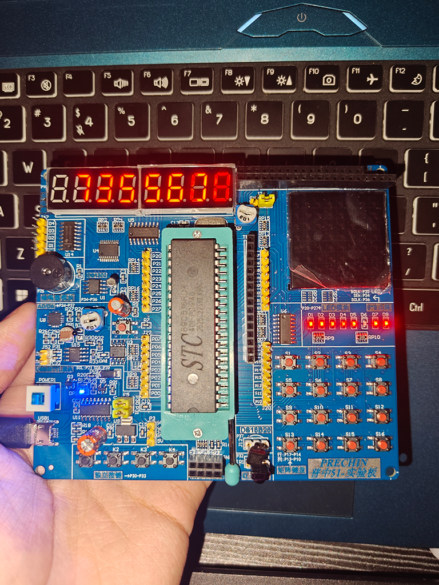

# 基于 51 单片机的密码倒计时控制系统

以 51 单片机为主控的密码倒计时控制系统（"C4 炸弹"模拟游戏）：
通过 4×4 矩阵键盘输入密码解除倒计时，超时触发声光报警。

## 功能

- **4×4 矩阵键盘输入**：数字键输入密码；增/减键调节倒计时时长；确认键启动；返回键（ESC）复位
- **8 位数码管动态扫描显示**：`LedBuff[8]` 显示缓冲 + 74HC138 三八译码器位选，
  8 位共用段选线轮流点亮
- **定时器双中断**：
  - 定时器 0：**10ms** 中断，负责数码管扫描与矩阵键盘扫描
  - 定时器 1：**1ms** 中断，翻转蜂鸣器引脚产生约 500Hz 发声
- **分级声光报警**：倒计时剩余 15s / 55s / 其他时段分别触发不同节奏的报警音
- **双工作模式**：倒计时模式与秒表模式，可通过键盘切换

## 硬件

- 主控：STC89C52RC（普中 51 实验板）
- 显示：8 位数码管 + 74HC138 位选译码
- 输入：4×4 矩阵键盘
- 提示：蜂鸣器 + LED

## 开发环境

Keil uVision（C 语言） · Proteus（电路仿真） · PZ-ISP（烧录）

## 实现要点

- **为什么用 74HC138 做位选**：8 位数码管若每位独立控制需要 64 根 I/O 口；
  用三八译码器只需要 3 根选通线 + 8 根段选线。
- **为什么定时器中断里不能放延时**：中断服务函数中执行延时会阻塞其他中断，
  破坏数码管扫描与蜂鸣器发声的时序。
- **动态扫描原理**：8 位数码管轮流点亮，靠人眼视觉暂留形成"同时显示"的效果，
  整屏刷新率需高于约 50Hz 才不会察觉闪烁。

## 说明

单片机课程设计。代码实现过程中使用 AI 编程助手辅助生成，逻辑参考公开资料；
硬件平台为普中 51 实验板，已完成实物烧录与联调。
